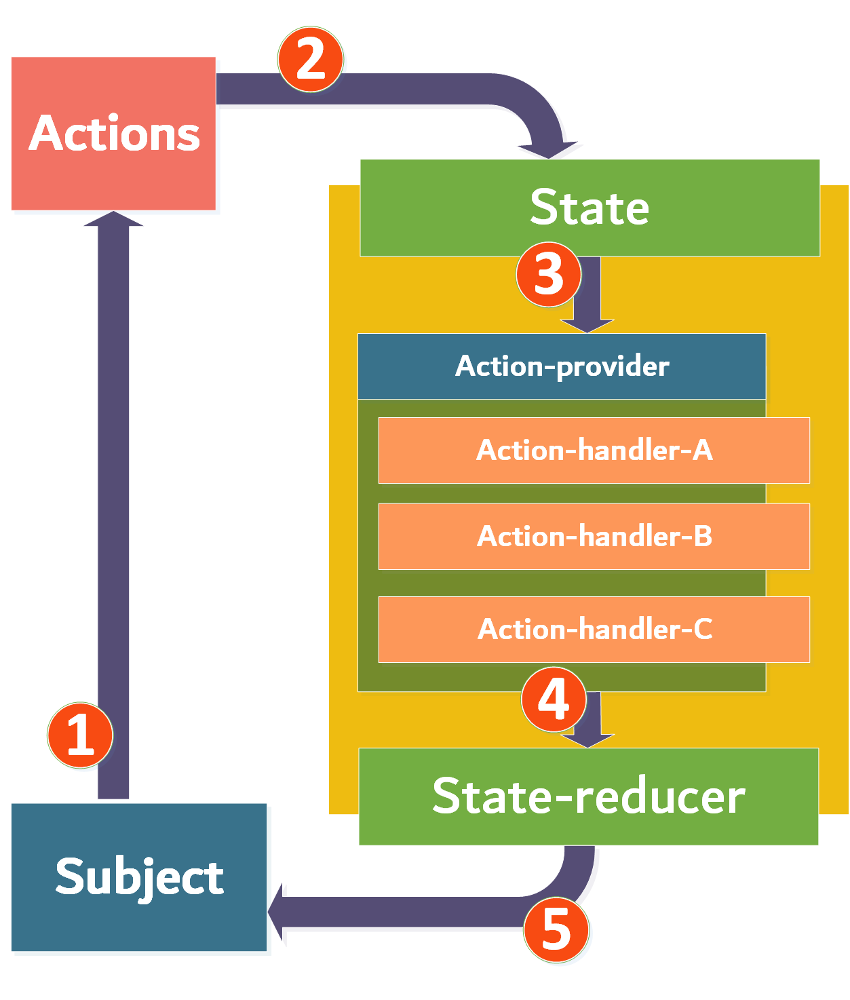
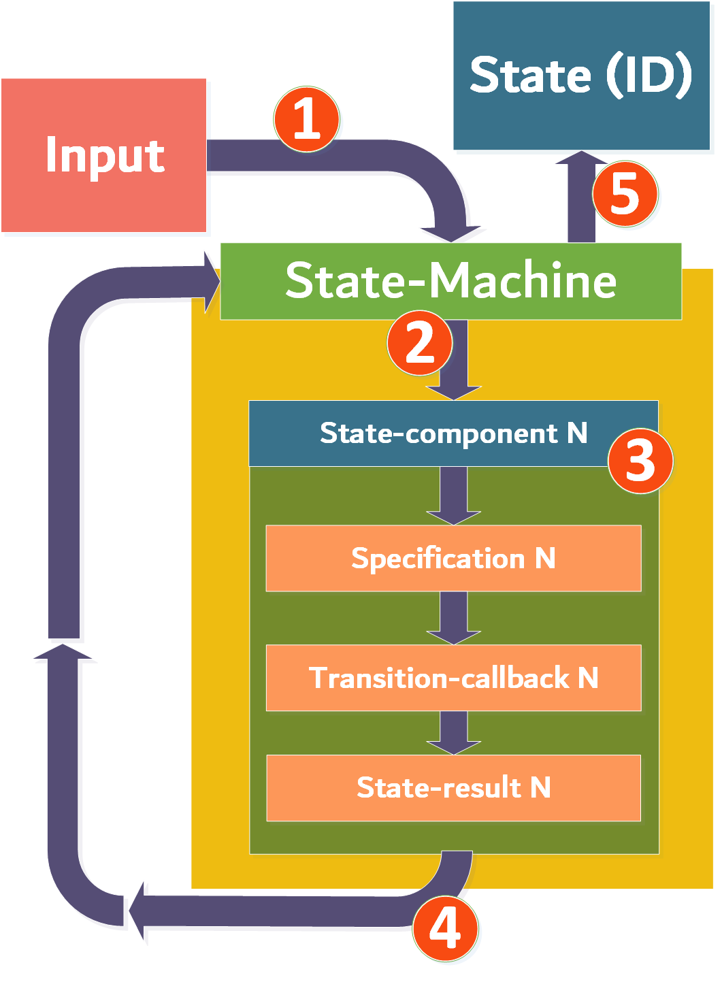

#  St8-ment

NuGet package pages:
- [St8-ment](https://www.nuget.org/packages/St8-ment/) 
- [St8-ment.DependencyInjection](https://www.nuget.org/packages/St8-ment.DependencyInjection/) 

## Introduction

A more flexible state/state-machine pattern library for **SOLID** state pattern design. Achieved by separating the state-object and the action + transitioning system into individual components. These transitions can be viewed as **request-handlers** in a request-to-handler model (like modern library such as [**MediatR**](https://github.com/jbogard/MediatR)). They respond to the input of an action and determine how a state transitions into other states.

Previously, the library provided a V1 and V2 version. However, because of some new insights into the matter, the whole library has gained an total overhaul. Use a version before **2.0.0** to use of the previous setup. The [documentation](./docs/README(old).md) regarding that setup has been relocated to the /docs section.

This version (3.0.0) of the **St8-ment** library contains a new subdivision in regards of state usage. This new approach is called the _State-Forge_ and is a response to concept of combining both the _State_ and _State-Machine_ pattern approaches. Furthermore, it is important to note that in this version the ActionHandlers and registration for the _State_ pattern approach have some breaking changes and should be addressed when upgrading.

## Table of content

- [St8-ment](#st8-ment)
  * [The problem](#the-problem)
  * [A solution](#a-solution)
    + [State](#state)
    + [State-machine](#state-machine)
    + [State-forge](#state-forge)
  * [How it works](#how-it-works)
    + [State workings](#state-workings)
    + [State-machine workings](#state-machine-workings)
    + [State-forge workings](#state-forge-workings)
  * [Coding Guide](#coding-guide)
    + [State coding](#state-coding)
      - [Subject](#subject)
      - [Action-Handlers](#action-handlers)
      - [Actions](#actions)
      - [States](#states)
      - [State-reducer registration and usage](#state-reducer-registration-and-usage)
    + [State-machine coding](#state-machine-coding)
      - [Guards](#guards)
      - [Transition-callbacks](#transition-callbacks)
      - [State-machine registration and usage](#state-machine-registration-and-usage)
    + [State-forge coding](#state-forge-coding)
      - [Difference in subject](#difference-in-subject)
      - [State-Forge and State](#state-forge-and-state)
      - [State-forge registration and usage](#state-forge-registration-and-usage)
  - [Reasons for using this library](#reasons-for-using-this-library)

<small><i><a href='http://ecotrust-canada.github.io/markdown-toc/'>Table of contents generated with markdown-toc</a></i></small>

## The problem

In the original state-pattern, the state objects (polymorphic implementations of a common state interface) contain the logic for state-transitions but also provide the same interface (in regards of methods/actions) as its subject. This means that when the subject changes its interface (class-structure), the state objects also have to be refactored. Furthermore, the state objects themselves also determine into which state they transition next when a certain action is applied. All this logic is fairly simple to apply and provides robust state guarding and transitioning. However, the extendibility and hardcoded logic both make it difficult to change certain aspects without re-implementing the whole state-object (or state-objects when the subject changes).


Next to that, the amount of responsibilities is increased, the abstraction for the those objects are growing as well and most configurations require the objects to communicate with one-another by the means of their concrete implementations instead of an abstraction. So altogether this pattern can cause some problems in regards to violating the SOLID design principles, although this is mostly accepted as this pattern is generally considered to be quite a well fitting solution. Nevertheless, this library tries to solve the aforementioned issues and takes the inspiration from multiple other initiatives like, i.e., the Redux Pattern + the StateMachine Pattern. 

## A solution

This library provides a proposed solution for the aforementioned problem. St8-ment provides to state-based pattern implementations, **state** and **state-machine**. The state version is a direct solution to aforementioned the state-pattern, whereas the state-machine pattern is a dedicated state-machine implementation. Both are designed with modern technology in mind and comes with **dependency injection** extensions for *Microsoft ServiceCollection*. 

The implementations are based on modern **request + request-handler** style solutions with makes it easier to use dependencies.

### State

The state-pattern based solution in this library uses a so-called state-reducer to create new states regarding a state-id and the subject. The state-objects refer to the reducer to get their corresponding action-providers which provides the action-handlers for a particular action that are registered on the respected state. These resulting action-handler objects are stored in key-value stores within the state-specific action-providers where the actions function as keys. When a state does contain an action-handler for a specific action, then that actions can be applied a possible transition into a new state could occur (that dependents on what the developer of that particular action-handler has in mind).

The actions (and corresponding actions-handlers) can be registered to a particular state by the means of the aforementioned dependency injection extensions.

**NOTE:** What is displayed in figure below is the belonging-to-hierarchy. The actual flow works a bit different and will be explain further down below in the section about the workings of the library components.


**NOTE:** Be aware that an action-handler object does not always handle a single state transition as it more or less an equivalent to the effects from the Redux libraries. They contain the state-logic like the methods in the standard state-pattern. Therefore they can make a decision to transition into a specific state or, when a specific condition fails for example, they could determine to transition into a different states. They could even choose to not transition into another state at all when no conditions are met. The subject will then stay in its current state. But these choices lay in the hands of the developers that create and manage their specific action-handlers.*

### State-machine

The state-machine version in this library is setup differently in respect to the state-based version. The state-machine version provides a transitions into new states controlled by the type of input that is provided to the state-machine. Every transition can have its own guard (specification by [**SpeciFire**](https://github.com/emprax/SpeciFire) library) and transition-callback, which are both completely optional but are recommended nonetheless. Every state has its own set of inputs it can react to, these can be registered to the state-machine by the aforementioned dependency injection extensions.

One specific difference in regards to the state-based version is that the transitions in the state-machine are predefined regarding into which new state the machine transitions. 

**NOTE:** *When a callback is execute and throws an exception, then this exception will be caught and provided in a specific result, however, the transition into the targeted state will no longer occur at that moment.*

### State-forge
The state-forge is a response to concept of combining both the _State_ and _State-Machine_ pattern approaches. It comes down to the idea of using the _State_ version approach, although the state is no longer held inside the state-subject. The reason for this is for when someone decides to create a state-subject that is not approached in a more aggregate type of way, or is more or less very transient in approach. When that is the case it could be very frustrating to have the state-subject be applied in such a way that it is always up for providing the state dependencies as it is currently done with the _State_ version of this library. So, to mitigate this problem it has been decided to at a state-forge as a injectable service into other clients or services much like the state-machine of the _State-machine_ version of this library. Therefore, the state-subject is just the holder of the state-id, being suitable to just be a data model type of object.

## How it works

### State workings

The diagram shown below is there to help creating an understanding of the system and it bears quite some similarity to the Redux diagram that can be found online. The numbers in the diagram refer to the steps that are described below the diagram. 



**Steps:**

1. The subject (in most cases a data-model, system or an aggregate-root (DDD)) can hold a state and has an *AcceptAction(...)* method that accepts an action. 
2. The action is transmitted it to the state accepted through its own *Accept* method.
3. The incoming action is being verified by the state, to determine whether it has an action-handler for it. This verification is achieved by determining whether the action-provider (retrieved from the state-reducer) actually contains an action-handler for this action. **NOTE:** The action-providers are stored in a special storage core in the reducer per state-id, so when a state wants to consult its corresponding action-handler, it should do so by querying the state-reducer. However, it could be the case that there is no action-handler for the respected state, hence a special state-response is returned to notify the caller of the accept method. A same sort of process will occur when an action cannot be mapped to a corresponding action-handler from the retrieved action-provider.
4. When the action-handler is successfully retrieved, it will be prompted to execute its logic regarding the provided action together with a state-view that contains the current state-id and the subject. When the process succeeds, the state will then again consult the state-reducer by calling its *SetState(...)* method. This method needs both the target state-id and the subject.
5. The state is then set to the subject and the cycle is complete. **NOTE:** When initializing the subject, it is a good idea to call the state-reducer (typed for that subject) and utilize the *SetState* method to setup the subject with an initial state.

### State-machine workings

Again a Redux-diagram-like diagram is used to visualize the steps for the state-machine based solution.



**Steps:**

1. An input applied to the state-machine.

2. The state-machine determines whether it has registered state transitions that adhere to the type of the input in combination with the current state.

3. When the corresponding transition is found, a few actions can be applied in order (otherwise see step **3.A.**):

   - (Optional) When there is a specification (implementation with a ISpec<T> from the **SpeciFire** library) as guard available, it will be called to check whether the input adheres to the specification. When the input does not adhere to the specification, this step will return a not-satisfied response, further actions after this case will be discussed in section **3.A**. 
     - When there is no guard available, this step will be skipped.
   - (Optional) When there a transition-callback available, it will be called to execute the callback operation. When the callback throws an exception, then this exception will be caught and this step will return an exception-response, further actions after this case will be discussed in section **3.A**. 
     - When there is no transition-callback available, this step will be skipped.
   - The final step in this block is to return a new state-id (the ID of the state that it should transition into).

   **A. Important:** When the registration of the state is provided with a default case, the failed steps, mentioned directly above, will at least return to the state component which will try to execute the default transition. This is a convenient feature for tidying up the failed cases. For example, by always transitioning into a fault-state when a failure occurs.

4. The retrieved state (ID) will be returned to the state-machine.
5. The state-machine will update its state by setting the new state-id.

### State-forge workings
The workings of the _State-forge_ version of this library is nearly identical to the _State_ version. The difference is that the state-forge is a dependency that accepts a specific state-subject to provide the application of actions on the provided state, instead of the state-subject being the entrypoint, directing to the internal state. It is a more dependency safe solution than the standard _State_ version.

## Coding Guide

This section emphasizes the important components of the library on behalf of some coding examples. Starting with the definition of some of the components in regard to their purpose and location within an application.

### State coding

#### subject

The subject contains the state. The state has to be set by the state-reducer by means of the *SetState(...)* method. So the best practice is to have a dedicated subject-provider (or repository, etc.) that retrieves, next to the state-subject implementing entity, also the state-reducer and places the state on the context. The subject delegates the determination of which actions are allow on current state of the subject to the state itself, but also to transition into another state when specified.

**NOTE:** The aforementioned provider/repository/etc. for providing the subject does not have to do return this alongside the subject because it is implicitly stored in the state when the state is set to the subject, so the subject already has it.

```c#
public class Order : ExtendedStateSubject<Order>, IAggregateRoot
{
    private readonly OrderEntity order;
    
    public Order(OrderEntity order) => this.order = order;
    
    //...........
}
```

The *Apply(...)* and *SetState(...)* methods are defined by the _ExtendedStateSubject<TSubject>_ abstraction, though can be overriden.

#### Action-Handlers

To implement the action-handlers, the intention is to implement the IActionHandler<TAction, TSubject> interface.

```c#
public class CancelOrderStateTransitioner : IActionHandler<CancelOrderAction, Order>
{
    private readonly IOrderService service;
    
    public CancelOrderStateTransitioner(IOrderService service)
    {
        this.service = service;
    }
    
    public async Task Execute(CancelOrderAction action, IStateHandle<Order> state)
    {
        var status = await this.service.CancelOrderAsync(state.Subject);
        if (status.Success)
        {
            state.Transition(OrderStates.Cancelled);
            return Task.CompletedTask;
        }
        
        if (status.Failed)
        {
            state.Transition(OrderStates.Failed);
        }
        
        // No need for change here, the state stays the same.
        return Task.CompletedTask;
    }
}
```

Note that the action-handler can handle multiple specific cases by which the transitioning into different states is taking place. The StateHandle is a small container providing both the subject and the transitioning functionality towards a new state.

#### Actions

The action object itself is not that interesting as it is more or less only a label in object form that can also contain some specific action-related data. For example:

```C#
public class CancleOrderAction : IAction { }
```

In this case there is no specific data provided by the action, but there are no rules against it, so feel free to add specific action-related data like what is similar to other commonly used request-like objects. That's being said, recalling what has been stated at the beginning of this document is that these actions function as requests in a request-to-handler mechanism corresponding to their handlers, in this case the action-handlers, much like frameworks such as [**MediatR**](https://github.com/jbogard/MediatR).

#### States

The state objects are implemented internally through the State<TSubject> class which implements the IState<TSubject> interface. Everything regarded state is all applied internally. The only modifiable aspect about the state is the StateId. This abstract class should be extended and be given a name.

#### State-reducer registration and usage

A new IServiceCollection extension is used to connect all the aforementioned components. It is provided by the **St8-ment.DependencyInjection** binary. A whole set of builders, appliers and other constructions are provided by this binary as well, but these are mostly only used by the *AddStateReducer* extension and therefore do not have a direct usage for the user/developer. The registration is applied through the use of builders in fluent-API style.

There is, however, one explicit construction that can be utilized that comes with this extension library. This regards the IStateConfiguration<TSubject> interface to create place the whole configuration regarding a specific state into a dedication configuration class, like the fluent configuration clients for **Entity Framework**.

```c#
services.AddStateReducer<Order>((builder, provider) => 
{
    builder
        .For(OrderStates.NewOrder, bldr => bldr.On<CheckOrderAction>().Handle<CheckNewOrderTransitioner>())
        .For(OrderStates.CheckedOrder, bldr =>
        {
            bldr.On<RemoveOrderAction>().Handle<RemoveCheckedOrderHandler>();
            bldr.On<DeliverOrderAction>().Handle<DeliverCheckedOrderHandler>();
            bldr.On<FailedOrderAction>().Handle<FailedCheckedOrderHandler>();
        })
        .For(new DeliveredOrderStateConfiguration())
        .For(OrderStates.RemovedOrder)
        .For(OrderStates.FailedOrder)
        .For(OrderStates.CompletedOrder);
});
```

Every state is registered by a *For(...)* method which, in the basis, accepts a state-id object instance and a configuration-lambda to build-up the action-triggered transitions. The builders have internal building mechanisms, hence the user/developer does not have to provide such an action.

A possible implementation of the IStateConfiguration<TSubject> interface looks like this:

```c#
public class DeliveredOrderStateConfiguration : IStateConfiguration<Order>
{
    public StateId StateId => OrderState.Delivered;
    
    public void Configure(IStateBuilder<Order> builder)
    {
        builder.On<CancelOrderAction>().Handle<CancelDeliveredOrderHandler>();
        builder.On<FailedOrderAction>().Handle<FailedDeliveredOrderHandler>();
        builder.On<CompleteOrderAction>().Handle<CompleteDeliveredOrderHandler>();
    }
}
```

**NOTE:** The state-reducer defined for a subject is registered Singleton, because it does not hold any state for its own and recreates the action-handlers and states on the fly, so the structure and order is therefore set in stone. However, when multiple different configurations of the state-reducer for the same subject have to be defined, a few specific constructs can be used to make this possible.

First is the the IStateReducerFactory<TKey, TSubject>, which is provided by the St8-ment core library and can be constructed as:

```c#
services.AddStateReducerFactory<string, Order>((builder, provider) => 
{
    builder
        AddStateReducer("ORDER-CREATION", buildr =>
        {
            buildr
                .For(OrderStates.NewOrder, bldr => bldr.On<CheckOrderAction>().Handle<CheckNewOrderHandler>())
                .For(OrderStates.CheckedOrder, bldr =>
                {
                    bldr.On<RemoveOrderAction>().Handle<RemoveCheckedOrderHandler>();
                    bldr.On<DeliverOrderAction>().Handle<DeliverCheckedOrderHandler>();
                    bldr.On<FailedOrderAction>().Handle<FailedCheckedOrderHandler>();
                });
        })
        .AddStateReducer("ORDER-DISTRIBUTION", buildr =>
        {
            buildr
                .For(new DeliveredOrderStateConfiguration())
                .For(OrderStates.RemovedOrder)
                .For(OrderStates.FailedOrder)
                .For(OrderStates.CompletedOrder);
        });
});

........
    
var reducer = this.factory.Create("ORDER-CREATION");	// When having the factory as dependency, it can create reducers.
reducer.SetState(OrderStates.New, order);				// One of the first common steps: Give the subject its initial state.
```

A possible second strategy is to use the [**ModulR**](https://github.com/emprax/ModulR) library to create custom IServiceCollection modules.

And now, a possible implementation regarding a repository providing a domain object and sets the initial state:

```c#
public class OrderRepository
{
    private readonly DbContext context;
    private readonly IStateReducer<Order> reducer;
    
    public async Task<Order> GetAsync(OrderNumber number)
    {
	    var entity = await this.context
            .Set<OrderEntity>()
            .SingleOrDefault(o => o.Number == number);	// Entity Framework implementation.
        
        var order new Order(entity);					// wrapping domain object strategy is used here.
        this.reducer.SetState(OrderStates.New, order);  // Set the initial state.
        
        return order;
    }
}

......

// The first state is NewOrderState which can transition into the CheckedOrderState.
await order.Apply(new CheckOrderAction());
    
// The CheckedOrderState can transition into the DeliveredOrderState.
await order.Apply(new DeliverOrderAction());
```


### State-machine coding

#### Guards

The guards are an optional addition to refine transitions. They guard the transitions with particular specifications. Such a specification is implements the ISpec<TContext> interface, provided by the [**SpeciFire**](https://github.com/emprax/SpeciFire) library.

```c#
public class HasPublishCommandSpec : Spec<string>
{
    public Expression AsExpression() => (value => value?.Contains("PUBLISH:") ?? false);
}
```

#### Transition-callbacks

The transition-callbacks are also an optional addition to refine transitions. They apply certain operations when their corresponding transition flows are executed. Such a transition-callback implements the ITransitionCallback<TInput> interface:

```c#
public class PublishCommandCallback : ITransitionCallback<string>
{
    private readonly ICommandCentre commandCentre;
    
    public PublishCommandCallback(ICommandCentre commandCentre) => this.commandCentre = commandCentre;
    
    public async Task Execute(string action)
    {
        //......
        await this.commandCentre.ApplyCommand(action);
        //......
    }
}
```

#### State-machine registration and usage

The dependency injection extensions for this library also contain the AddStateMachine and AddStateMachineFactory extensions. Other classes, except for the IStateConfiguration interface, have no direct usages for the user/developer and are for internally utilized mechanisms. Note the *OnDefault()* calls, these are for default transition flows for when nothing else can matches.

```C#
services.AddStateMachine((builder, provider) => 
{
    builder
        .For(CommandStates.New, bldr => bldr.On<string>().To(CommandStates.Checking))
        .For(CommandStates.Published, bldr =>
        {
            bldr.On<string>().WithGuard<HasCompletionCommandSpec>().To(CommandStates.Completed)
                .OnDefault().To(CommandStates.Checking);
        })
    	.For(new RemovedCommandStateConfiguration())
        .For(CommandStates.Fault)
        .For(CommandStates.Checking, bldr => 
        {
            bldr.On<string>()
                .WithGuard<HasPublishCommandSpec>()
                .WithCallback<PublishCommandCallback>()
                .To(CommandStates.Published)
                
            bldr.On<string>()
                .WithCallback<RemoveCommandCallback>()
                .To(CommandStates.Removed);
        })
        .For(CommandStates.Completed);
});
```

A few things can be observed within this section. The configurations for the states work again on state-ids and trigger on specific input types. Each *On<TInput>()* method provides its own transition path. Each path can have a guard and a transition-callback, and these can be registered in a multitude of ways as there are a number of method overloads for these registration methods. This is displayed as well in the example of a state-configuration below.

An example of a custom state-configuration would look like this:

```C#
public class RemovedCommandStateConfiguration : StateConfiguration
{
    protected override void Configure(IStateComponentBuilder builder)
    {
        builder
            .OnDefault()
                .WithCallback<FaultedCommandNotificationCallback>()
                .To(CommandStates.Fault)
            .On<string>()
                .WithGuard(x => x.Contains("COMPLETE:"))
                .WithCallback<CompleteCommandCallback>()
                .To(CommandStates.Completed);
    }
}
```

The factory part of the library has a similar setup as that the one of the state-based solution. Only here the constructions as seen in the above code sections are used instead of the state-based factory setup. So, the *AddStateReducer(...)* methods in the *AddStateReducerFactory<TKey, TSubject>(...)* extension are written here as *AddStateMachine(...)* methods in the *AddStateMachineFactory<TKey>(...)* extension with the registration code for state-machines from the code sections above.

Now, when everything is registered, the system can be used in software solutions. 

```c#
// 1.)  Starting at the NEW-state and applying some text.
await this.stateMachine.Apply("SOME FANCY TEXT.");

// 2.)  The previous step ensured that the state-machine transitioned into the CHECKING-state.
await this.stateMachine.Apply("PUBLISH: This new fancy text.");

// 3.)  Because of the text applied in the previous step containing 'PUBLISH:', the state-machine transitioned into PUBLISHED.
await this.stateMachine.Apply("COMPLETE: This new fancy text that was published.");

// FINALLY: Because the PUBLISHED-state has the HasCompleteCommandSpec to check the inputted text,
// the state-machine finished in the COMPLETED-state.
```

### State-forge coding
As stated before, the _State-forge_ version is near identical to the _State_ version, though with a dependency specific state-forge service that can be used to insert the state-subject and apply actions to the provided state profile.

#### Difference in subject
The same subject as with the _State_ version approach can be used as this state-subject implements the _ExtendedStateSubject_ abstraction which again implements the _StateSubject_ abstraction, though a less detailed version of this subject that just implements the _StateSubject_ abstraction is enough. It is important that the state-subject has the identity property with the _StateId_ type.

```C#
public class Order : StateSubject { }  // Has the StateId property. The value of this property can be adjusted by the library components as it marked with a 'protected internal' modifier.
```

#### State-Forge and State
The state-forge itself is a state-machine like structure that can be injected into a certain service/client to help in applying actions to the state-subject:
```C#
await stateForge
    .Connect(subject)
    .Apply(new DeliverOrderAction());
```

The state itself is returned by the invokation of the _Connect(...)_ method and provides the _Apply(...)_ method which accepts and applies the actions.

#### State-forge registration and usage
State-forge registration has a near identical setup as the _State_ version approach in registration, though instead of a state-reducer factory, a state-forge is being registered. One additional aspect has to be noted, which is the StateConfiguration. The one for the _ _State-forge_ version is called the StateForgeStateConfiguration as it is not compatible with the StateConfiguration of the _State_ version.
```C#
services.AddStateForge((b, _) => 
{
    b.Connect<Order>(builder =>
    {
        builder
            .For(OrderStates.NewOrder, bldr => bldr.On<CheckOrderAction>().Handle<CheckNewOrderHandler>())
            .For(new DeliveredOrderStateConfiguration())
            .For(OrderStates.CheckedOrder, bldr =>
            {
                bldr.On<RemoveOrderAction>().Handle<RemoveCheckedOrderHandler>();
                bldr.On<DeliverOrderAction>().Handle<DeliverCheckedOrderHandler>();
                bldr.On<FailedOrderAction>().Handle<FailedCheckedOrderHandler>();
            });
    });
});
```

```c#
public class DeliveredOrderStateConfiguration : IStateForgeStateConfiguration<Order>
{
    public StateId StateId => OrderState.Delivered;
    
    public void Configure(IStateForgeStateBuilder<Order> builder)
    {
        builder.On<CancelOrderAction>().Handle<CancelDeliveredOrderHandler>();
        builder.On<FailedOrderAction>().Handle<FailedDeliveredOrderHandler>();
        builder.On<CompleteOrderAction>().Handle<CompleteDeliveredOrderHandler>();
    }
}
```


## Reasons for using this library

This library is useful for a more flexible, modern and solidified state pattern design. Note that the state pattern is already known for being quite a suitable design pattern in multiple solutions. Therefore this library provides even more SOLID design in state usage. The library has quite some similarities to the Redux library, but it is still its own take on the appliance of state and the patterns that are related to that, and not to forget that the Redux-pattern is for state-management on applications themselves, so guarded state-pattern application in programming structures is not the focus there. Hence this library is more or less a combination of the state-pattern and state-machine pattern with some influences from different approaches and modern loose-coupling practices. So, when wanting to use a SOLID designed state transitioning systems or a more flexible but still guarded state-pattern implementation for your software, then this library is a great choice.
