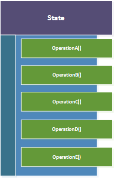
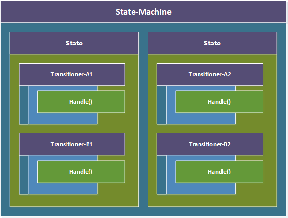
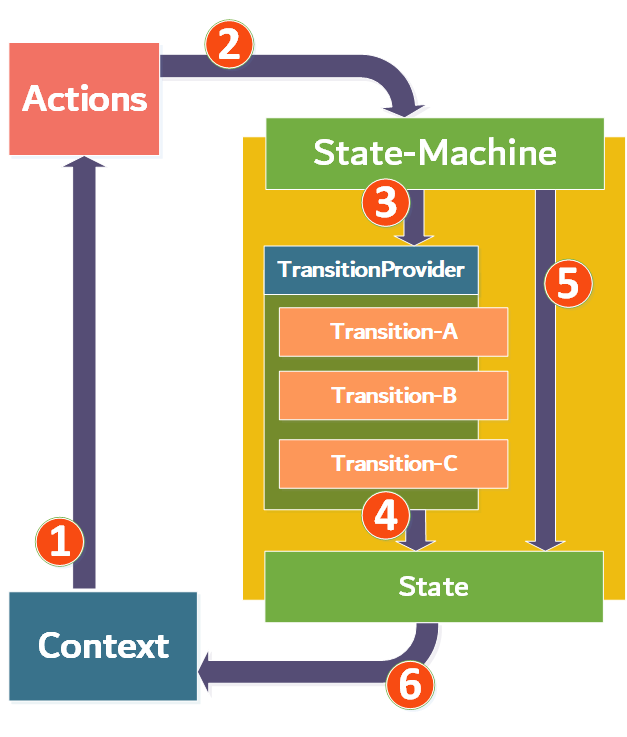
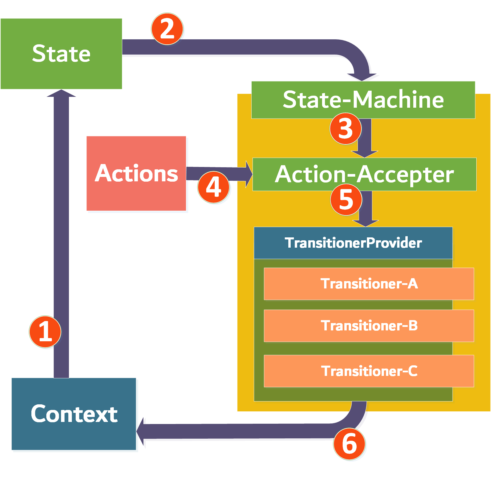

#  St8-ment
A dynamic state/state-machine pattern library for SOLID state pattern design. Achieved by separating the state-object and the action + transitioning system (here called the transitioners) into individual components. The transitioners can be viewed as request-handlers in a request-to-handler model. They respond to the input of an action and determine how a state transitions into other chosen states. An action and the state-object itself are combined into a transaction which is the actual request model. There the actions are labels as well as models at the same time that contain the data for the requests.

The library provides a V1 and V2 version. The V1 is closely modelled after the State Design Pattern, whereas the V2 version is more or less the StateMachine version of this pattern. The V2 focusses less on the behavior in the state itself. Because of this, the state does not contain specific dependencies, in contrast to the V1 version where the state contains the transitioner-provider object. The state in V1 can thus only be created by the means of deriving them from dependency injection registrations. The V2 does not place this emphasis on the state object and by this provides the possibility to use simple mapping from 1 state to another inside the provided transitioners. Conclusively this comes down at that the V1 version does not provide this possibility as the state holds the logic to determine which transitioners to use as well as that the context should at that point be more responsible for the data. The V2 provides more freedom as the state object is now more suitable to hold transient data similar to the action objects.

## Table of content

- [St8-ment](#st8-ment)
  * [The problem](#the-problem)
  * [A solution](#a-solution)
    + [V1](#v1)
    + [V2](#v2)
  * [How it works](#how-it-works)
    + [V1](#v1-1)
    + [V2](#v2-1)
  * [Coding Guide](#coding-guide)
    + [Context](#context)
      - [V2](#v2-2)
    + [Transitioners](#transitioners)
      - [V2](#v2-3)
    + [Actions](#actions)
    + [States](#states)
      - [V2](#v2-4)
    + [Registration and usage](#registration-and-usage)
      - [V2](#v2-5)
  - [Usecase](#usecase)

<small><i><a href='http://ecotrust-canada.github.io/markdown-toc/'>Table of contents generated with markdown-toc</a></i></small>

## The problem

The transitioners in this library contain the state-logic that is usually housed in the state-object itself, when regarding the standard state pattern. But these type of states in the official state pattern are confined to the amount of methods that state object contains. The state in this case usually contains the same methods as the state context. So extending the amount of operations that require state specific transitions can only be achieved by modifying the class-structure of both the state and the context. 



Next to that, the amount of responsibilities is increased, the abstraction for the those objects are growing as well and most configurations require the objects to communicate with one-another by the means of their concrete implementations instead of an abstraction. So altogether this pattern can cause some problems in regards to violating the SOLID design principles, although this is mostly accepted as this pattern is generally considered to be quite a well fitting solution. This library tries to solve the aforementioned issues and takes the inspiration from multiple other initiatives like, i.e., the Redux Pattern + the StateMachine Pattern. 

## A solution

As prompted before, there is a V1 version and V2 version of the code solution, both with their own ideas that lead to their respective designs.

### V1

The library consists of state-machines that provide and create the state-objects for a specific context each. The state-objects refer to a provider/registry which stores all the different transitioner-objects for that state. These transitioner-objects are stored in a key-value store where the actions function as keys. When a state does contain a transitioner-object for a specific action, then that transitioner can be applied.



**Note:** The transitioner-objects are called transitioners because of there purpose/behavior similar to transitions, but be aware that a transitioner-object does not always handle a single state transition as it more or less an equivalent to the effects from the Redux libraries. They contain the state-logic like the methods in the standard state-pattern and can therefore make a decision to transition to one state or, when a specific condition fails for example, they could determine to transition to a different states. They could even transition into none at all when no conditions are met and stay in their current states. But these choices lay in the hands of the developer that create and manage their specific transitioners.

### V2

The V2 version differs from V1 in a sense that the order/hierarchy of the components referring to one another are different. Where in the V1 version the state has the foreground, there the V2 version passes that spot to the StateMachine. The context provides its state to the StateMachine by which an action accepter accepts and applies an action to a chosen transitioner. The StateMachine holds the providers for the transitioners, passes them to the action accepter and the action is again used, in combination with the state, as a transaction to find the matching transitioner. The transaction is then again used as request that is sent into that state transitioner.

## How it works

### V1

The diagram shown below is there to help creating an understanding of the system and it bears quite some similarity to the Redux diagram that can be found online. The numbers in the diagram refer to the described steps below. **Note:** A separate path can be taken and is determined by a condition. It is not shown as a number but will be described in the steps.



**Steps:**

1. The context (in most cases an aggregate-root) contains the state and an accept method that accepts an action. 
2. The action is transported to the state and accepted by the state its own accept method.
3. The incoming action is being verified by the state, to determine whether it has a transitioner related to that action. This verification is achieved by determining whether the TransitionerProvider actually contains a transitioner for this action.
4. When this is the case, the chosen transitioner executes its logic where it can then use the state-machine to choose the next state. 
5. The state is eventually set to the context and the cycle is complete. But when the transitioner cannot be found, a boolean determining the success of the state transition operation returned by the accepting methods will be false and no state changes are made.


Here is a diagram displaying the flow horizontally:


### V2

For V2, there are a handful of changes in regards to what was described in the V1 section.



**Steps:**

1. The context (again, in most cases an aggregate-root) contains the state.
2. The state is provided to the StateMachine which determines the right transitioners provider for that specific state. Be aware that the StateMachine is used like a visitor here and it visits the state by a special Connect method, from there further operations can be applied.
3. The TransitionerProvider is being encapsulated in an ActionAccepter and an action can now be applied to it.
4. The incoming action object is being verified by the ActionAccepter, to determine whether there is a transitioner related to that action. This verification is achieved by determining whether the TransitionerProvider actually contains a transitioner for this action.
5. When this is the case, the chosen transitioner executes its logic by which it can then change to a next state, this makes the transition a bit easier than the V1 version as the data can now be passed from one state to another one. 
6. The state is eventually set to the context and the cycle is complete. But when the transitioner cannot be found, a boolean determining the success of the state transition operation returned by the accepting methods will be false and no state changes are made.


Here is a diagram displaying the flow horizontally:


## Coding Guide

This section emphasizes the important components of the library on behalf of some coding examples. Starting with the definition of some of the components in regard to their purpose and location within an application. At first the V1 version will be discussed and then the V2 will be compared to V1 per section.

### Context

The context contains the state. It uses the state to determine which actions are allowed and how to transition to another state, by the means of the transitioners, when a certain action is being issued. 

```c#
public class Order : IAggregateRoot, IStateContext<Order>
{
    public IState<Order> State { get; private set; }
    
    public Task<bool> Accept<TAction>(TAction action, CancellationToken cancellationToken) where TAction : IAction
    {
        //...........
        return State.Accept(action, cancellationToken);
    }
    
    public void SetState<TState>(TState state) where TState : class, IState<ExampleContext>
    {
        //...........
     	this.State = state;   
    }
    
    //...........
}
```

The *Accept(...)* and *SetState(...)* methods are the to be implemented methods regarding the IStateContext<TContext> interface.

#### V2

The V2 version of the context is nearly the same, but differs in a specific detail. The Accept method is removed in this version as the context purely contains the state and the state is no longer the main command-center. The state is now more similar to a status + data containing object that can be used in combination with an action to form a transaction to a transitioner.

```c#
public class Order : IAggregateRoot, IStateContext<Order>
{
    public IState<Order> State { get; private set; }
    
    public void SetState<TState>(TState state) where TState : class, IState<ExampleContext>
    {
        //...........
     	this.State = state;   
    }
    
    //...........
}
```


### Transitioners

To implement the state transitioners, the intention is to implement the StateTransitioner abstract-class instead of the IStateTransitioner interface, as the abstraction applies some specific generic operations that are applied in the background. 

```c#
public class CancelOrderStateTransitioner : StateTransitioner<ProcessedOrderState, Order, CancelOrderAction>
{
    private readonly ISpecificationFactory factory;
    
    public CancelOrderStateTransitioner(
        IStateMachine<ExampleContext> stateMachine, 
        ISpecificationFactory factory) : base(stateMachine) 
    {
        this.factory = factory;
    }
    
    protected override async Task Transition(
        StateTransaction<CancelOrderAction, ProcessedOrderState> transaction, 
        IStateMachine<Order> stateMachine, 
        CancellationToken cancellationToken)
    {
        var specification = factory.Obtain<ProcessedOrderState>(Specification.CanCancelOrderSpec);
        if (specification?.IsSatisfiedBy(transaction.State) ?? false)
        {
            await specification.Handle(transaction.State);
            stateMachine.Apply<CancelledOrderState>(transaction.State.Context);
            return;
        }
        
		// Do nothing or change state to a specific different state that handles a failed attempt to cancel the order.
    }
}
```

As you can see the transitioner can handle multiple specific paths of transitioning into different states regarding specific conditions. Notice that the StateTransitioner has three generics. The first one regards the current state, the second the context and the third one is the action it is supposed handle.

#### V2

The V2 version of the transitioner has been drastically changed as the StateTransitioner abstract class is no longer needed to fulfill the right setup.

```C#
public class CancelOrderStateTransitioner : IStateTransitioner<ProcessedOrderState, Order, CancelOrderAction>
{
    private readonly ISpecificationFactory factory;
    
    public CancelOrderStateTransitioner(ISpecificationFactory factory) => this.factory = factory;
    
    public async Task Transition(IStateTransaction<CancelOrderAction, ProcessedOrderState> transaction)
    {
        var specification = factory.Obtain<ProcessedOrderState>(Specification.CanCancelOrderSpec);
        if (specification?.IsSatisfiedBy(transaction.State) ?? false)
        {
            await specification.Handle(transaction.State);
            transaction.State.Context.SetState(new ProcessingState(transaction.State.Context)
            {
                Data = transaction.State.Data
            });
            
            return;
        }
        
		// Do nothing or change state to a specific different state that handles a failed attempt to cancel the order.
    }
}
```

The IStateTransitioner interface can now be used directly. The StateMachine is no longer needed here as it has gained a more prominent role up front in the V2 version. Data transactions from one state to the other are also much more flexible.

### Actions

The action object itself is not that interesting as it is more or less only a label in object form that can also contain some specific action-related data. For example:

```C#
public class CancleOrderAction : IAction { }
```

In this case there is no specific data displayed, but there are no rules against it, so feel free to add specific action-related data like what is similar to other commonly used request-like objects. 

The V2 version of the actions are the same.

### States

The state objects are implemented by extending the State<TSelf, TContext> abstract class, which contains the IStateTransitionerProvider. The transitioner provider is used to determine the transitioner to use in regards to the provided action. When a transitioner for the specified action cannot be found, it will simply return false to indicate the transaction failed. 

```C#
public class NewOrderState : State<NewOrderState, Order>
{
    public NewOrderState(ExampleContext context, IStateTransitionerProvider provider) : base(context, provider)
    {
        this.Name = "A new order has been created";
    }

    public string Name { get; }

    protected override NewOrderState GetSelf() => this;
}
```

This NewOrderState is an implementation of the State object. It provides its own type with the TSelf generic of the State and the Order as context with the TContext generic. The GetSelf method returns the TSelf initialized object for usage in other cases. The state can contain specific data in regard to the relation between the context and that specific state.

#### V2

Again, like the transitioners, the V2 version of the states are quite a bit different. The State<TSelf, TContext> abstract class is still used but is setup a bit differently. The GetSelf method is no longer needed to provide the state as the state can now be created simply by calling its constructor. In the V1 version the states had a more prominent role with dependencies and had to be registered in the DI. Next to that, the V1 state needed to provide itself to the DI construction to simply construct itself, while as with the V2 this is no longer the case.

```c#
public class NewOrderState : State<NewOrderState, Order>
{
    public NewOrderState(ExampleContext context) : base(context)
    {
        this.Name = "A new order has been created";
    }

    public string Name { get; }
}
```

Nevertheless, the State abstraction still contains a Connect method, that accepts a StateMachine. The StateMachine, used here as visitor, uses the State object type setup to create the right abstraction.

### Registration and usage

A new IServiceCollection extension is used to connect all the aforementioned components. It is provided by the St8-ment.DependencyInjection binary. A whole set of builders, appliers and other constructions are provided by this binary as well, but these are purely used by the AddStateMachine extension.

```C#
services.AddStateMachine<Order>(builder => 
{
    builder.For<NewOrderState>(configurator => configurator.On<CheckOrderAction>().Transition<CheckNewOrderTransitioner>());
    builder.For<CheckedOrderState>(configurator =>
    {
        configurator.On<RemoveOrderAction>().Transition<RemoveCheckedOrderTransitioner>());
        configurator.On<DeliverOrderAction>().Transition<DeliverCheckedOrderTransitioner>());
        configurator.On<FailedOrderAction>().Transition<FailedCheckedOrderTransitioner>());
    });
    builder.For<DeliveredOrderState>(new DeliveredOrderStateConfiguration());
    builder.For<RemovedOrderState>();
    builder.For<FailedOrderState>();
    builder.For<CompletedOrderState>();
});
```

A few things can be observed within this section. The configuration for a specific state can be created by using the For method on the builder, followed by either a lambda-expression that registers all transitioners or by a custom configuration that extends the StateConfiguration abstract class. At last, there is the option to register no configuration for a state which is necessary for assuring that the state-machine knows that state, but doesn't have any actions for it, effectively creating a sink state.

An example of a custom state-configuration would look like this:

```C#
public class DeliveredOrderStateConfiguration : StateConfiguration<DeliveredOrderState, Order>
{
    protected override void Configure(IStateConfigurator<TState, TContext> configurator)
    {
        configurator
            .On<CancelOrderAction>()
            .Transition<CancelDeliveredOrderTransitioner>();
        
        configurator
            .On<FailedOrderAction>()
            .Transition<FailedDeliveredOrderTransitioner>();
        
        configurator
            .On<CompleteOrderAction>()
            .Transition<CompleteDeliveredOrderTransitioner>();
    }
}
```

Now, when everything is registered, the system can be used in software solutions. 

```c#
var order = Order.Create(...);
stateMachine.Apply<NewOrderState>(context);

......

// The first state is NewOrderState which can transition into the CheckedOrderState.
await context.Accept(new CheckOrderAction(), CancellationToken.None);	 

// The CheckedOrderState can transition into the DeliveredOrderState.
await context.Accept(new DeliverOrderAction(), CancellationToken.None);

// The DeliveredOrderState can transition into the CompletedOrderState.
await context.Accept(new CompleteOrderAction(), CancellationToken.None);
```

#### V2

The V2 version of the registrations for the StateMachines is near identical to the V1 version. The use of the StateMachine however, is a bit different.

```c#
var order = Order.Create(...);
order.SetState(new NewOrderState(order));

......

// The first state is NewOrderState which can transition into the CheckedOrderState.
await context.State
    .Connect(stateMachine)
    .Apply(new CheckOrderAction());
    
// The CheckedOrderState can transition into the DeliveredOrderState.
await context.State
    .Connect(stateMachine)
    .Apply(new DeliverOrderAction());

// The DeliveredOrderState can transition into the CompletedOrderState. Note the use of the StateContextExtensions Apply method.
await context.Apply(stateMachine, new CompleteOrderAction());
```

First the state in the context is set to a new order (note that this could also be integration in a more intuitive way, but it depends on the choices of the developer. The simple, but still a bit specific, use of the SetState method is being shown here to illustrate an example of usage). The state in the context is being visited by the StateMachine through the Connect method of the state. The StateMachine retrieves some specific state type setup and can then retrieve the right TransitionerProvider by providing a specific ActionAccepter. The action is being applied to the accepter and the state system is set in motion. 

Note the use of a specific extension-method called *Apply*, what is an extension to the IStateContext and encapsulates the aforementioned State - StateMachine with Action interaction.


## Usecase

This library is useful for a more dynamic and solidified state pattern design. Note that the state pattern is already known for being quite a suitable design pattern in multiple solutions. Therefore this library provides even more SOLID design in state usage. The library has quite some similarities to the Redux library, but it is still its own take on the appliance of state and the patterns that are related to that. Hence this library is more or less a combination of the state pattern and state-machine pattern with some Redux influences.