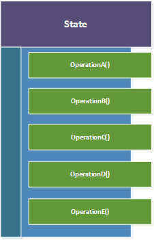
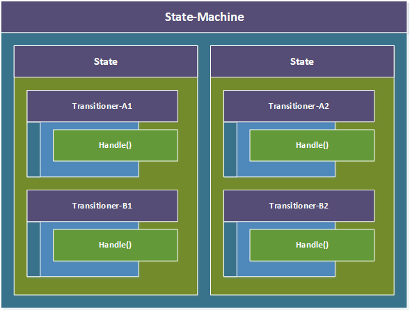
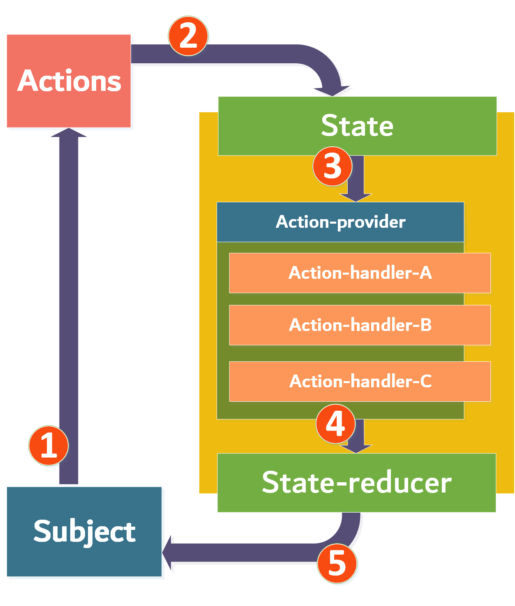
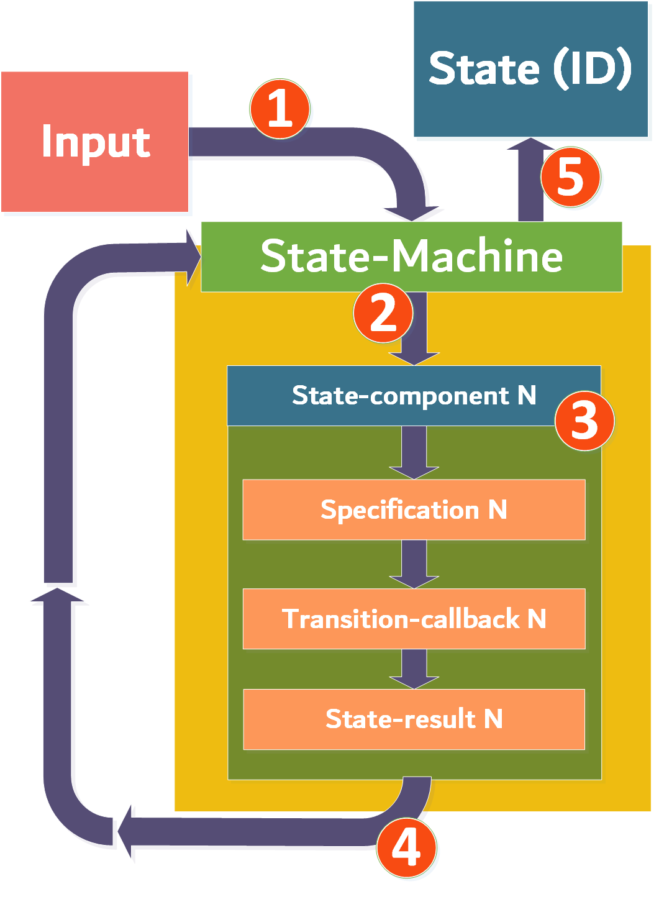

#  St8-ment

NuGet package pages:
- [St8-ment](https://www.nuget.org/packages/St8-ment/) 
- [St8-ment.DependencyInjection](https://www.nuget.org/packages/St8-ment.DependencyInjection/) 

## Introduction
First and foremost, this library provides a redefined version of the **State Design Pattern**, with the focus on modern SOLID software engineering in mind. It draws inspiretion from state-machines and the **Redux** library. Furthermore, libraries such as **MediatR**, that apply the request-to-handler pattern, are of influence to achieve this modern approach.

## Table of content
- [St8-ment](#st8-ment)
  * [Two types of solutions in this library](#two-types-of-solutions-in-this-library)
  * [The problem](#the-problem)
  * [A solution](#a-solution)
    + [State](#state)
    + [State-machine](#state-machine)
  * [How it works](#how-it-works)
    + [State workings](#state-workings)
    + [State-machine workings](#state-machine-workings)
  * [Final Remarks](#final-remarks)

<small><i><a href='http://ecotrust-canada.github.io/markdown-toc/'>Table of contents generated with markdown-toc</a></i></small>

## Two types of solutions in this library
There are two solutions that this library provides:
- State: Focuses on the state pattern implementation with SOLID design and request-to-handler constructions.
- StateMachine: Focuses on the creation of state-machines that is different though also similar to the State solution.

## The problem
In the original state-pattern, the state objects (polymorphic implementations of a common state interface) contain the logic for state-transitions but also provide the same interface (in regards of methods/actions) as its subject. This means that when the subject changes its interface (class-structure), the state objects also have to be refactored. Furthermore, the state objects themselves also determine into which state they transition next when a certain action is applied. All this logic is fairly simple to apply and provides robust state guarding and transitioning. However, the extendibility and hardcoded logic both make it difficult to change certain aspects without re-implementing the whole state-object (or state-objects when the subject changes).

Next to that, the amount of responsibilities is increased, the abstraction for the those objects are growing as well and most configurations require the objects to communicate with one-another by the means of their concrete implementations instead of an abstraction. So altogether this pattern can cause some problems in regards to violating the SOLID design principles, although this is mostly accepted as this pattern is generally considered to be quite a well fitting solution. Nevertheless, this library tries to solve the aforementioned issues and takes the inspiration from multiple other initiatives like, i.e., the Redux Pattern + the StateMachine Pattern. 

## A solution
This library provides a proposed solution for the aforementioned problem. St8-ment provides to state-based pattern implementations, **state** and **state-machine**. The state version is a direct solution to aforementioned the state-pattern, whereas the state-machine pattern is a dedicated state-machine implementation. Both are designed with modern technology in mind and comes with **dependency injection** extensions for *Microsoft ServiceCollection*. 

The implementations are based on modern **request + request-handler** style solutions with makes it easier to use dependencies.

### State
The state-pattern based solution in this library uses a so-called state-reducer to create new states regarding a state-id and the subject. The state-objects refer to the reducer to get their corresponding action-providers which provides the action-handlers for a particular action that are registered on the respected state. These resulting action-handler objects are stored in key-value stores within the state-specific action-providers where the actions function as keys. When a state does contain an action-handler for a specific action, then that actions can be applied a possible transition into a new state could occur (that dependents on what the developer of that particular action-handler has in mind).

The actions (and corresponding actions-handlers) can be registered to a particular state by either a factory or the provided dependency injection extensions.

**NOTE:** What is displayed in figure below is the *belonging-to-hierarchy* model. The actual flow works a bit different and will be explain further down below in the section about the workings of the library components.

**NOTE:** Be aware that an action-handler object does not always handle a single state transition as it more or less an equivalent to the effects from the Redux libraries. They contain the state-logic like the methods in the standard state-pattern. Therefore they can make a decision to transition into a specific state or, when a specific condition fails for example, they could determine to transition into a different states. They could even choose to not transition into another state at all when no conditions are met. The subject will then stay in its current state. But these choices lay in the hands of the developers that create and manage their specific action-handlers.*

### State-machine
The state-machine version in this library has a setup different from the state-based version. The state-machine version provides transitions into new states controlled by the type of input that is provided to the state-machine. Every transition can have its own guard (specification by [**SpeciFire**](https://github.com/emprax/SpeciFire) library) and transition-callback, which are both completely optional but are recommended nonetheless. Every state has its own set of inputs it can react to, these can be registered to the state-machine though factory or dependency injection extensions.

One specific difference in regards to the state-based version is that the transitions in the state-machine are predefined, whereas the user can define the different state transitions within the action-handlers of the state-based version.

**NOTE:** *When a callback is executed and throws an exception, this exception will be caught and provided in a result without breaking the flow. Yet, the transition into the targeted state will no longer happen because of the exception.*

## How it works

### State workings
The diagram shown below is there to help creating an understanding of the system and it bears quite some similarity to the Redux diagram that can be found online. The numbers in the diagram refer to the steps that are described below the diagram. 

**Steps:**
1. The subject (in most cases a data-model, system or an aggregate-root (DDD)) can hold a state with a state-identity.
2. An action can be defined and is applied by the state reducer. 
3. The reducer looks for available action-handlers based on the state-identity of the subject.
4. Found a suitable action-handler, the reducer executes the handler.
5. The handler executes its behavior and is provided with a state-handle (which refers back the state-reducer) to set the next state.
6. The state-identity that results from this is updated to the subject by the state-reducer.

### State-machine workings
Again a Redux-diagram-like diagram is used to visualize the steps for the state-machine based solution.

**Steps:**
1. An input applied to the state-machine.
2. The state-machine determines whether it has registered state transitions that adhere to the type of the input in combination with the current state.
3. When the corresponding transition is found, a few actions can be applied in order (otherwise see step **3.A.**):
   - (Optional) When there is a specification (implementation with a ISpec<T> from the **SpeciFire** library) as guard available, it will be called to check whether the input adheres to the specification. When the input does not adhere to the specification, this step will return a not-satisfied response, further actions after this case will be discussed in section **3.A**. 
     - When there is no guard available, this step will be skipped.
   - (Optional) When there a transition-callback available, it will be called to execute the callback operation. When the callback throws an exception, then this exception will be caught and this step will return an exception-response, further actions after this case will be discussed in section **3.A**. 
     - When there is no transition-callback available, this step will be skipped.
   - The final step in this block is to return a new state-id (the ID of the state that it should transition into).

   **A. Important:** When the registration of the state is provided with a default case, the failed steps, mentioned directly above, will at least return to the state component which will try to execute the default transition. This is a convenient feature for tidying up the failed cases. For example, by always transitioning into a fault-state when a failure occurs.
4. The retrieved state (ID) will be returned to the state-machine.
5. The state-machine will update its state by setting the new state-id.

## Final remarks
There is a console project (an test-cases) attached to this repository with an example of the state-based version and the state-machine version. We refer to those projects to see examples of how the systems work. We have refrained from provding extensive examples in this README file because of changing constructions over time.