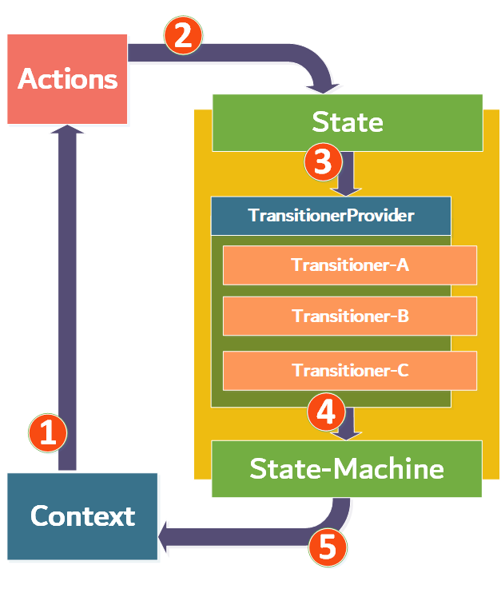

# St8-ment
A dynamic state/state-machine pattern library for SOLID state pattern design. This is achieved by separating the state-object and the action + transitioner into separate components whereas the transitioners are considered to be request-handlers in a request-to-handler model. They respond to the input of an action and determine how a state transitions into other states. An action and the state-object itself are combined in a transaction which is the actual request model. There the actions are labels and models at the same time that hold the data for the requests.

### The problem

The transitioners hold the state-logic that is usually housed in the state-object itself, when regarding the standard State Pattern, but is confined to the amount of methods a state holds. The state in this case usually contains the same methods as the context it is considered to be the state for. So extending the amount of operations that require state specific transitions can only be achieved by modifying the class-structure of both the state and the context. 


Next to that the amount of responsibilities is increased, the abstraction for the those objects are growing as well and most configurations require the objects to communicate with one-another by the means of their concrete implementations instead of an abstraction. So altogether this pattern can cause some problems in regards to violating the SOLID design principles, although this is mostly accepted as this pattern is considered to be quite a well fitting solution. This library tries to solve the aforementioned issues and takes the inspiration from multiple other initiatives like, i.e., the Redux Pattern. 

### A solution

The library consists of state-machines that provide and create the state-objects for a specific context each. The state-objects refer to a provider/registry which stores all the different transitioner-objects from that state, where these transitioner-objects are stored in a key-value store by which the actions function as keys. When a state does contain a transitioner-object for a specific action, then that transitioner can be applied.


**Note:** The transitioner-objects are called transitioners because of there purpose/behavior, but be aware that a transitioner-object does not always handle a single state transition as it more or less an equivalent to the effects from the Redux libraries. They hold the state-logic like the methods in the standard state-pattern and can therefore make a decision to transition to one state or, when a specific condition fails for example, it could determine to transition to a different state or even none at all when no conditions are met and stay in their current state. But these choices lay in the hands of the developer of specific transitioners.

### How it works

The diagram shown below is there to support the understanding of the system and it bears quite some similarity to the Redux diagram that can be found quite easily online. The numbers in the diagram refer to the described steps. **Note:** A separate path that can be taken and is determined by condition is not shown as a number but will be described in the steps.



**Steps:**

1. The context (mostly a system or aggregate-root) contains the state and an accept method that accepts an action. 
2. The actions is transported to the state and accepted by the state its own accept method.
3. The incoming action is being verified by the state, to determine whether there is a transitioner related to that action. This verification is achieved by determining whether the TransitionerProvider actually contains a transitioner for this action.
4. When this is the case, the chosen transitioner executes its logic by which it can then use the state-machine to choose the next state. 
5. The state is eventually set to the context and the cycle is complete. But when the transitioner cannot be found, a boolean determining the success of the state transition operation returned by the accepting methods to be false and no state changes have been made.


### Coding Guide

This section emphasizes the important components of the library on the basis of some coding examples. We first start with the definition of some of the components in regard to their purpose and location within an application.

#### Context

The context is the state holder. It uses the state to determine which actions are allowed and how to transition to another state, by the means of the transitioners, when a certain action is being issued. 

```c#
public class Order : IAggregateRoot, IStateContext<Order>
{
    public IState<Order> State { get; private set; }
    
    public Task<bool> Accept<TAction>(TAction action, CancellationToken cancellationToken) where TAction : IAction
    {
        //...........
        return State.Accept(action, cancellationToken);
    }
    
    public void SetState<TState>(TState state) where TState : class, IState<ExampleContext>
    {
        //...........
     	this.State = state;   
    }
    
    //...........
}
```

The *Accept(...)* and *SetState(...)* methods are the to be implemented methods regarding the IStateContext<TContext> interface.

#### Transitioners

To implement the state transitioners it is the intention to implement the StateTransitioner abstract-class instead of the IStateTransitioner interface, as the abstraction provides just a bit more clear processing details than what the interface is providing. 

```c#
public class CancelOrderStateTransitioner : StateTransitioner<ProcessedOrderState, Order, CancelOrderAction>
{
    private readonly ISpecificationFactory factory;
    
    public CancelOrderStateTransitioner(
        IStateMachine<ExampleContext> stateMachine, 
        ISpecificationFactory factory) : base(stateMachine) 
    {
        this.factory = factory;
    }
    
    protected override async Task Transition(
        StateTransaction<CancelOrderAction, ProcessedOrderState> transaction, 
        IStateMachine<Order> stateMachine, 
        CancellationToken cancellationToken)
    {
        var specification = factory.Obtain<ProcessedOrderState>(Specification.CanCancelOrderSpec);
        if (specification?.IsSatisfiedBy(transaction.State) ?? false)
        {
            await specification.Handle(transaction.State);
            stateMachine.Apply<CancelledOrderState>(transaction.State.Context);
            return;
        }
        
		// Do nothing or change state to a specific different state that handles a failed attempt to cancel the order.
    }
}
```

As you can see the transitioner can handle multiple specific paths of transitioning into different states in regards to specific conditions. Notice that the StateTransitioner has three generics that have to be set. The first one the regards the current state, the second the context and the third one the action it is supposed handle.

The action object itself is not that interesting as it is nearly only a label as object that can also provide some specific action-related data.

